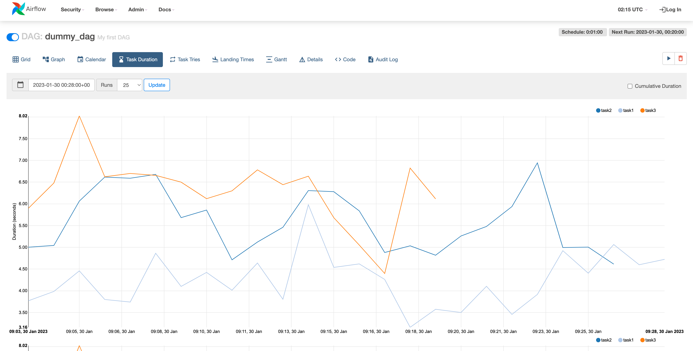

# Week3 - Using Apache Airflow to build Data Pipelines

<figure style="text-align: center;">
    
    <figcaption align="center">수업 자료 - Start Apache Airflow</figcaption>
</figure> 
<br/><br/>

<figure style="text-align: center;">
    
    <figcaption align="center">수업 자료 - Open the Airflow Web UI</figcaption>
</figure> 
<br/><br/>

<br/>

```bash
airflow dags list             # To list out all the existing DAGs
airflow tasks list tutorial   # To list out all the tasks in the DAG named 'tutorial'
airflow dags unpause tutorial # To unpause a DAG
airflow dags pause tutorial   # to pause a DAG
```

<br/>

## Explore the anatomy of a DAG
Airflow Dag는 파이썬 프로그램이고, 다음과 같은 Logical blocks으로 구성되어 있음. <br/>

1. Imports

```python
### Import the libraries

from datetime import timedelta
# The DAG object; we'll need this to instantiate a DAG
from airflow import DAG
# Operators; we need this to write tasks!
from airflow.operators.bash_operator import BashOperator
# This makes scheduling easy
from airflow.utils.dates import days_ago
```

<br/>

2. DAG Arguments
- the owner name,
- when this DAG should run from: days_age(0) means today,
- the email address where the alerts are sent to,
- whether alert must be sent on failure,
- whether alert must be sent on retry,
- the number of retries in case of failure, and
- the time delay between retries.

```python
### Defining DAG arguments

# You can override them on a per-task basis during operator initialization
default_args = {
    'owner': 'Ramesh Sannareddy',
    'start_date': days_ago(0),
    'email': ['ramesh@somemail.com'],
    'email_on_failure': True,
    'email_on_retry': True,
    'retries': 1,
    'retry_delay': timedelta(minutes=5),
}
```

<br/>

3. DAG Definition
- dag 라는 이름의 DAG를 다음과 같은 파라미터를 가지고 생성
- DAG의 ID는 `sample-etl-dag`이고, web console에서 확인할 수 있는 것
- 위의 Dag Arguments에서 설정했던 `default_args` 값을 가져오기
- 해당 DAG가 무엇을 하는지 설명해줄 수 있는 description
- 해당 DAG가 얼마나 자주 실행되는지 설명해줄 수 있는 schedule_interval. 아래 케이스는 하루에 한 번 실행

```python
### Define the DAG

dag = DAG(
    dag_id='sample-etl-dag',
    default_args=default_args,
    description='Sample ETL DAG using Bash',
    schedule_interval=timedelta(days=1),
)
```

<br/>

4. Task Definitions
- task_id는 string으로 표현하고, task를 식별하는 것을 도와줌
- dag는 해당 테스크가 어디에 속해있는지 보여줌

```python
### Define the tasks

# define the first task named extract
extract = BashOperator(
    task_id='extract',
    bash_command='echo "extract"',
    dag=dag,
)

# define the second task named transform
transform = BashOperator(
    task_id='transform',
    bash_command='echo "transform"',
    dag=dag,
)

# define the third task named load

load = BashOperator(
    task_id='load',
    bash_command='echo "load"',
    dag=dag,
)
```

<br/>

5. Task Pipeline: 작업의 순서를 결정 (이 테스크는 extract - transform - load 순으로 실행)

```python
### Task pipeline
extract >> transform >> load
```

## Monitoring a DAG

<figure style="text-align: center;">
    
    <figcaption align="center">수업 자료 - Pause/Unpause a DAG (Grid View)</figcaption>
</figure> 
<br/><br/>

<figure style="text-align: center;">
    
    <figcaption align="center">수업 자료 - Pause/Unpause a DAG (Task Duration View)</figcaption>
</figure> 
<br/><br/>
