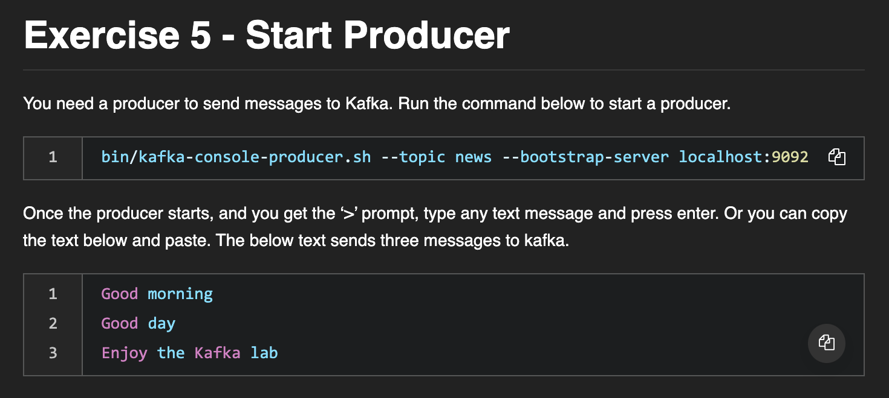

# Week4 - Using Apache Kafka to build Pipelines for Streaming Data

<figure style="text-align: center;">
    
    <figcaption align="center">수업 자료 - Download and extract Kafka</figcaption>
</figure> 
<br/><br/>

<figure style="text-align: center;">
    
    <figcaption align="center">수업 자료 - Start ZooKeeper</figcaption>
</figure> 
<br/><br/>

<figure style="text-align: center;">
    
    <figcaption align="center">수업 자료 - Start the Kafka Broker</figcaption>
</figure> 
<br/><br/>

```bash
cd kafka_2.12-2.8.0
bin/kafka-topics.sh --create --topic news --bootstrap-server localhost:9092
```

<figure style="text-align: center;">
    
    <figcaption align="center">수업 자료 - Create a Topic</figcaption>
</figure> 
<br/><br/>

```bash
bin/kafka-console-producer.sh --topic news --bootstrap-server localhost:9092
```

<figure style="text-align: center;">
    
    <figcaption align="center">수업 자료 - Start Producer</figcaption>
</figure> 
<br/><br/>

```bash
cd kafka_2.12-2.8.0
bin/kafka-console-consumer.sh --topic news --from-beginning --bootstrap-server localhost:9092
```

<figure style="text-align: center;">
    
    <figcaption align="center">수업 자료 - Start Consumer</figcaption>
</figure> 
<br/><br/>

```bash
### Practice Exercise

# Create a new topic named weather
bin/kafka-topics.sh --create --topic weather --bootstrap-server localhost:9092

# Post messages to the topic weather
bin/kafka-console-producer.sh --topic weather --bootstrap-server localhost:9092

# Read the messages from the topic weather
bin/kafka-console-consumer.sh --topic weather --from-beginning --bootstrap-server localhost:9092
```